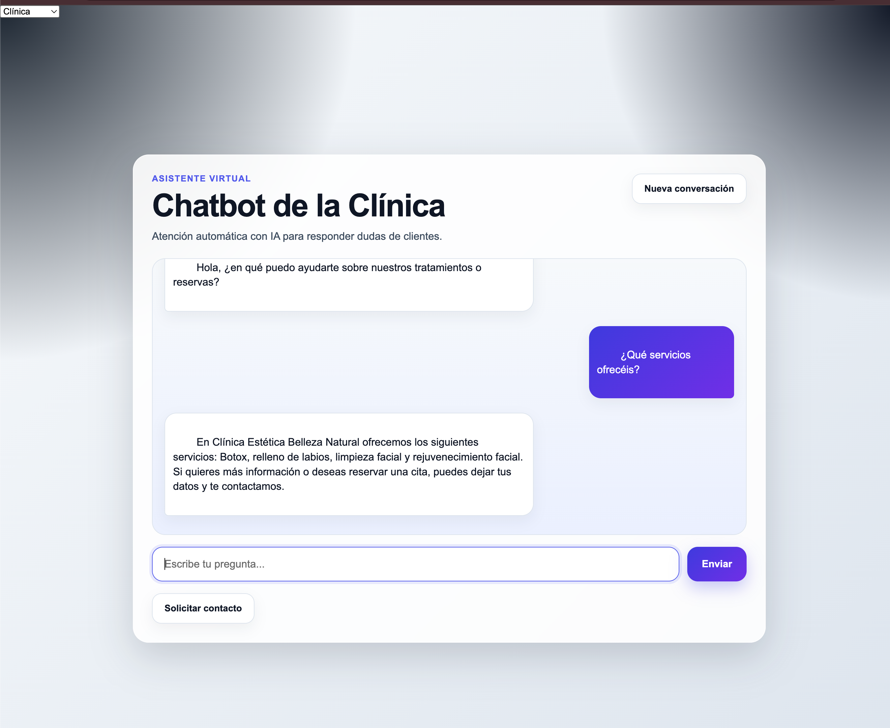
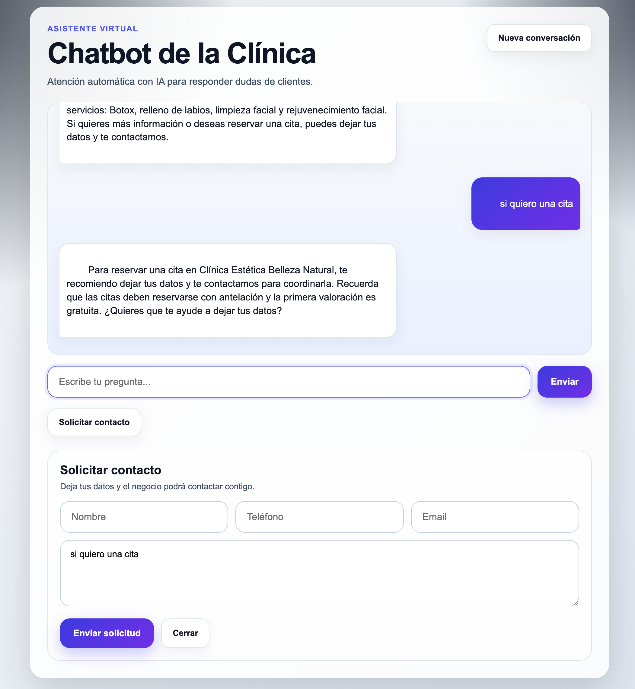
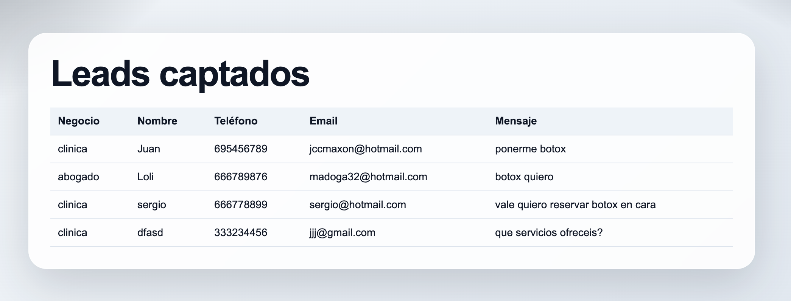

# AI Business Chatbot

Multi-business AI chatbot built with FastAPI and OpenAI for customer support, FAQ automation, and lead capture.

## Quick Start

```bash
python3 -m venv venv
source venv/bin/activate
pip install -r requirements.txt
uvicorn app.main:app --reload
```

Open in your browser:

```bash
http://127.0.0.1:8000
```

## Preview







## Features

- Multi-business chatbot interface
- Dynamic business context selection
- OpenAI-powered responses
- Conversation memory by business
- Reset conversation feature
- Intent-based lead capture flow
- Contact form integration
- Leads stored in JSON
- Simple leads dashboard
- Online demo deployed on Render

## Tech Stack

- Python
- FastAPI
- Uvicorn
- OpenAI API
- HTML
- CSS
- JavaScript
- JSON
- Render

## Project Structure

```bash
chatbot-negocio/
│
├── app/
│   ├── main.py
│   ├── ai_service.py
│   ├── leads.json
│   └── data/
│       ├── clinica.txt
│       ├── inmobiliaria.txt
│       └── abogado.txt
│
├── static/
│   ├── index.html
│   ├── style.css
│   ├── script.js
│   ├── leads.html
│   └── leads.js
│
├── assets/
├── requirements.txt
└── README.md
```

## Installation

```bash
git clone <TU_REPO_URL>
cd chatbot-negocio
python3 -m venv venv
source venv/bin/activate
pip install -r requirements.txt
```

## Configuration

Create a `.env` file in the project root:

```env
OPENAI_API_KEY=your_api_key_here
```

## Usage

- Select a business type
- Ask business-related questions
- The chatbot responds using the selected context
- If the user shows strong commercial intent, the lead form can appear automatically
- Leads are stored and can be reviewed in the leads panel

## Leads View

Open this route in your browser:

```bash
http://127.0.0.1:8000/leads-view
```

## Example Output

Typical flows supported by the chatbot:
- FAQ automation
- customer support answers
- lead qualification
- business-specific replies
- contact form suggestion
- lead storage for follow-up

## Use Cases

- Clinics
- Real estate businesses
- Legal offices
- Local service businesses
- Landing pages with lead capture
- FAQ automation for small businesses

## Future Improvements

- Persistent database for leads
- Authentication for the admin panel
- Email / WhatsApp integration
- Booking system
- Analytics dashboard
- Multi-language support
- Retrieval from business documents

## Author

Developed by Juan Carrasco as part of a freelance-oriented portfolio focused on AI, automation, and business tools.
